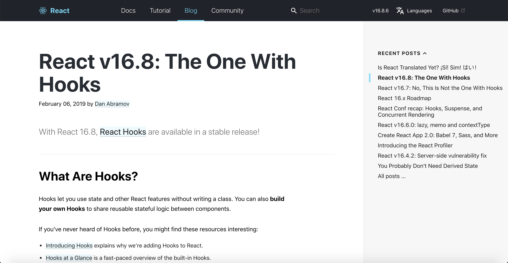
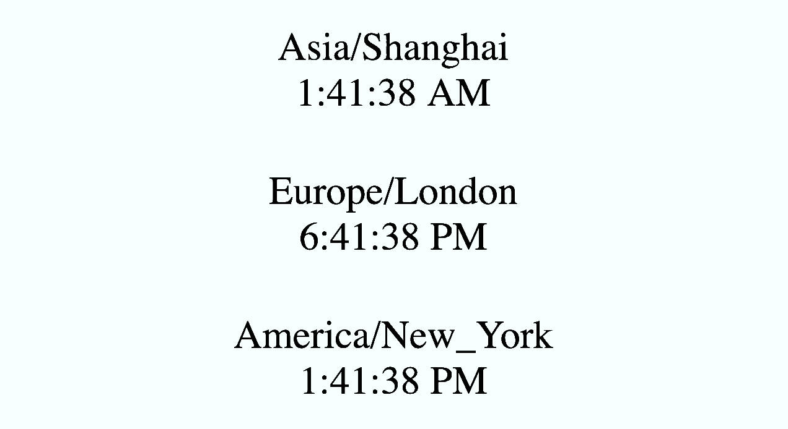
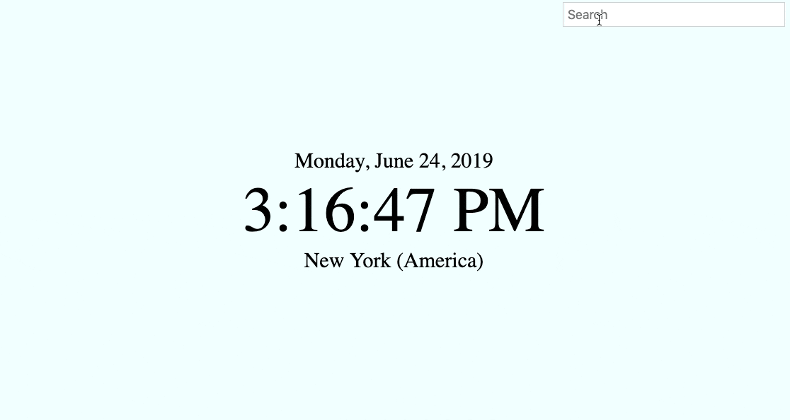

# React Hooks

---



[Try React](https://reactjs.org/docs/getting-started.html#try-react)

---

#### Basic Example


---

#### Common Styles

@code[css](code/lightbulb.css)

[Get the Code](https://raw.githubusercontent.com/wyncode/gitpitch_react_hooks/master/code/lightbulb.css)

---


#### Manual DOM Manipulation

@code[sh](code/lightbulb_simple_vanilla.html)

@[13,17,18,20](Hard code in the default state into the HTML)
@[23-25](Query the dynamic elements from the DOM)
@[27-37](Write a function that manually changes the DOM)
@[39](Attach the function to an event handler)

[Get the Code](https://raw.githubusercontent.com/wyncode/gitpitch_react_hooks/master/code/lightbulb_simple_vanilla.html)

---

#### React Class Component

@code[sh](code/lightbulb_simple_react_class.html)

@[17-18](Declare the initial state inside a class component)
@[20-22](Declare an instance method that can change state)
@[24-26](Declare a render function that returns some JSX)
@[27,32,35](Declare how the component should display in various states)
@[42](Have ReactDOM render the class into the DOM)

[Get the Code](https://raw.githubusercontent.com/wyncode/gitpitch_react_hooks/master/code/lightbulb_simple_react_class.html)

---

#### Smart Class / Dumb Functions

@code[sh](code/lightbulb_simple_react_functional.html)

@[17-22](State and functions that can change state are declared in the outermost class component)
@[24-32](State and functions can be passed down to child components as props)
@[35-42](Child components are stateless functions that return JSX based on the value of their props)
@[44-48](Behaviors are injected as props from the smart containter component)

[Get the Code](https://raw.githubusercontent.com/wyncode/gitpitch_react_hooks/master/code/lightbulb_simple_react_functional.html)

---

#### Smart Functions

@code[sh](code/lightbulb_simple_react_hooks.html)

@[17-22](useState to maintain state in a functional component, declare individual functions inside to change state)
@[24-29](Everything else is the same as the last example)
@[32-45](These components are still "dumb")

[Get the Code](https://raw.githubusercontent.com/wyncode/gitpitch_react_hooks/master/code/lightbulb_simple_react_hooks.html)

---

#### Functional Context

@code[sh](code/lightbulb_simple_hooks_context.html)

@[17-26](Create a context and a provider for that context.  The provider takes some local state and makes it accessible to any of its children that want to use that context.)
@[28-36](The Room will want to use the LightContext.  So will the Lightbulb and the LightSwitch.  However, we can now decouple them and avoid having to pass down state as props.)
@[38-48](The Lightbulb can consume the LightContext independent of the Room)
@[50-62](Same goes for LightSwitch.  And now, the function that changes state lives in a place that makes a little more sense.)
@[64-70](To make this work, we have to wrap the whole room in the LightProvider.  Lightbulb and LightSwitch get access because they are children of room.  ReactDOM renders the whole app, not just the Room.)

[Get the Code](https://raw.githubusercontent.com/wyncode/gitpitch_react_hooks/master/code/lightbulb_simple_react_hooks_context.html)

---

#### Takeaways

* Classes no longer needed (performance enhancement?)
* No need to remember `bind` or `this` (who cares?)
* Enhanced access to Context API (Helps decouple presentation from data)
* This is more code but...
* Reduces need for Redux (none of these examples needed Redux, but you get the idea)

---

#### Lifecycle / useEffect


---

#### Class Clock

@code[sh](code/clock_react.html)

@[24-25](Declare the initial state inside a class component)
@[35-37](Declare an instance method that can change state)
@[39-45](Declare a render function that returns some JSX)
@[27-33](Lifecycle methods may reference the instance `this`)

[Get the Code](https://raw.githubusercontent.com/wyncode/gitpitch_react_hooks/master/code/clock_react.html)

---

#### Hooks Clock

@code[sh](code/clock_react_hooks.html)

@[24-25](Declare initial state in a functional component)
@[27-29](Declare a function that can change state)
@[39](Return some JSX)
@[31-37](useEffect instead of lifecycle methods)
@[32-35](useEffect takes a function...)
@[36](...and an array of dependencies -- in this case there are none, meaning this function will only run once, right when the component mounts.)
@[33](Set up similar to componentDidMount)
@[34](Tear down similar to componentWillUnmount)

[Get the Code](https://raw.githubusercontent.com/wyncode/gitpitch_react_hooks/master/code/clock_react_hooks.html)

---

#### Context Clock(s)



---

#### Context Clock(s)

@code[sh](code/clock_react_hooks_context.html)

@[24-26](Create a context and a provider for that context.)
@[27](The provider takes some local state...)
@[41-45](and makes it accessible to any of its children that want to use that context.)
@[29-31](Declare a function that can change state)
@[33-39](useEffect instead of lifecycle methods)
@[48-60](Clock is a functional stateless component)
@[49](That consumes the TimeContext)
@[53,56](And accepts a timeZone as a prop)
@[62-68](App wraps 3 different clocks, each with its own timeZone, in a TimeProvider)
@[70](ReactDOM renders the whole app inro the body)

[Get the Code](https://raw.githubusercontent.com/wyncode/gitpitch_react_hooks/master/code/clock_react_hooks_context.html)

---

#### Takeaways

* One piece of data can be shared with 3 different components via `useContext`
* Props reserved for what _differentiates_ components, not simple data passing
* Set up and tear down all in one place, but syntax takes getting used to

---

#### Independent Study



[Get the Code](https://github.com/andyweiss1982/timezone-clock) | [useRef Easter Egg](https://github.com/andyweiss1982/timezone-clock/blob/f95c3b5ba2c07dc5b2ba694d59d85528d18d1ad1/src/components/TimeZonePicker.js#L9)

---

#### React Forex


---

#### Class Forex

@code[sh](code/forex_react.html)

@[30-35](Declare the initial state inside a class component)
@[37-45](Declare an instance method that can change state)
@[47-50](Lifecycle method sets first meaningful state)
@[52-60](Event handler functions that respond to user interaction)
@[47-55](Note, we have to remember exactly when we need to refetch rates)
@[64-67](Declare a render function that returns some JSX)
@[68-74](Attach change handlers to corresponding change events)
@[74-82](Declare how the component should display in various states)
@[85-93](Declare how the component should display in various states)

[Get the Code](https://raw.githubusercontent.com/wyncode/gitpitch_react_hooks/master/code/forex_react.html)

---

#### Functional Forex

@code[sh](code/forex_react_hooks.html)

@[30-33](Set initial state inside of function)
@[35-47](useEffect to fetch rates as soon as the page loads)
@[46](This means we will automatically refetch rates every time the base changes.)
@[46](When this array is empty, the function only executes once.)
@[46](If this array is not present, the function will run on every single render.)
@[49-55](Now these functions can be a lot simpler.)

[Get the Code](https://raw.githubusercontent.com/wyncode/gitpitch_react_hooks/master/code/forex_react_hooks.html)

---

#### Pros / Cons

* Set up and tear down can go in the same place
* Less code, but syntax is a little strange and magical
* We will probably just get used to it?

---

#### Guided Study


[Get the Code](https://github.com/andyweiss1982/the_fakebook)

---

#### Guided Study

```sh
import React from 'react'
import { UserProvider } from './contexts/UserContext'
import Navbar from './components/Navbar'
import Auth from './components/Auth'
import Profile from './components/Profile'

const App = () => (
  <UserProvider>
    <Navbar />
    <Auth>
      <Profile />
    </Auth>
  </UserProvider>
)

export default App
```

@[7-14](UserProvider wraps 3 components, each of which gets the current user through UserContext)

---

#### Guided Study

```sh
import React, { useContext } from 'react'
import { UserContext } from '../contexts/UserContext'

const Auth = props => {
  const { user, signIn } = useContext(UserContext)

  const authenticate = () => {
    fetch('https://randomuser.me/api/?nat=us')
      .then(response => response.json())
      .then(data => signIn(data.results[0]))
  }

  if (user) return props.children
  return (
    <main>
      <h1>Welcome to FakeBook</h1>
      <button onClick={authenticate}>
        Sign In
      </button>
    </main>
  )
}

export default Auth
```

@[4-11](Auth gets signIn from UserContext, uses it to authenticate a random user.)
@[13-21](If there is a user, Auth's children are rendered.  Otherwise a login screen.)

---

# React Hooks

* [Hooks at a Glance](https://reactjs.org/docs/hooks-overview.html)
* [90% Cleaner Code with Hooks](https://www.youtube.com/watch?v=wXLf18DsV-I)
* [useHooks.com](https://usehooks.com/)
